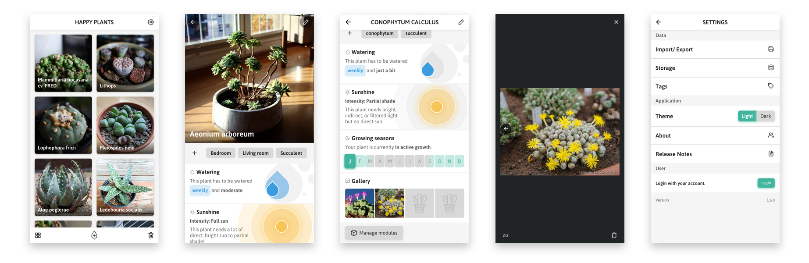

<h1 align="center">
  
</h1>

  Current version: <code>1.7.0</code> <a href="CHANGELOG.md">(Changelog)</a>

  
  

---

[_HappyPlants_](https://happyplants.garden) is all about collecting, organising, and adding all kinds of information of your little friends. _How much water does it need? During which seasons does it grow? When is it dormant? Does it require lots of sun?_ Basically, creating your own plant database in a visual way. You can either save HappyPlants to your homescreens on mobile devices (recommended) or add it to your bookmarks on desktop. This is a mobile-first, progressive web application.

This project adheres to the Contributor Covenant [code of conduct](CODE_OF_CONDUCT.md).
By participating, you are expected to uphold this code. Please report unacceptable behavior.

-   [✨ Features](#features)
-   [⌨️ Development](#development)
-   [🎉 Credits](#credits)

---

## ✨ Features

For upcoming features, ideas, and general roadmap, see the [Roadmap board](https://github.com/morkro/happy-plants/projects/5).

Overview of all available features:

**General**
- 🔋 Save all data either _locally on device_ (via IndexedDB) or in the cloud (Firebase)
  - 🗝 Sign in options: Twitter, GitHub, Google
- 📦 Import/Export your plant data
- 📦 Migrate your data from local storage to Firebase and vice versa
- 💡 Dark/Light Theme
- 📱 Responsive layout with mobile-first focus

**Plants**
- 🗂 Add, delete, modify your plants
- 🔖 Add _tags_ to your plants for better organisation
- Add different modules to each plant:
  - 💦 Watering schedule
  - ☀️ Sunshine requirements
  - 🌱 Growth cycle
  - 📝 Notes
  - 🖼 Gallery

## ⌨️ Development
This is a Vue.js progressive web application, developed with [`@vue/cli`](https://github.com/vuejs/vue-cli).

| Command | Description |
| ------- | ----------- |
| `npm install` | Installs dependencies |
| `npm run serve` | Serve with hot reload at localhost:8080 |
| `npm run build` | Build for production with minification |
| `npm test:unit` | Run all unit tests |
| `npm lint` | Runs `standard` over all `.js` and `.vue` files |
| `npm lint:style` | Uses Stylelint to lint all CSS |

## 🎉 Credits
### Logo
The logo is a combination of existing illustrations by [Vitaly Gorbachev](https://www.flaticon.com/authors/vitaly-gorbachev) and [Freepik](https://www.flaticon.com/authors/freepik).

### Icons
Icons taken from [Freepik](http://www.freepik.com) and [Dimitry Miroliubov](http://www.flaticon.com/authors/dimitry-miroliubov).

## License
[MIT](https:/github.com/morkro/happy-plants/LICENSE)
