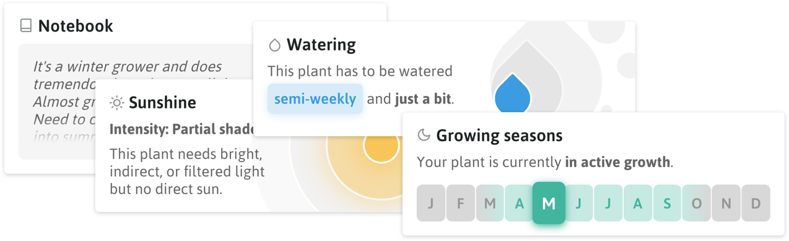

<h1 align="center">
  
</h1>

  Current version: <code>1.7.3</code> <a href="packages/app/CHANGELOG.md">(Changelog)</a>

  
  

---

## 🛠 HappyPlants v2 in development!

HappyPlants v2 is currently in development and lives in [`feature/next`](https://github.com/morkro/happy-plants/tree/feature/next). It will be a complete rebuild from scratch, eliminating some early architectural design decision issues. 

You can follow the progress on the [**v2 project board**](https://github.com/morkro/happy-plants/projects/6). I am currently finalising the new design and features.

---

[_HappyPlants_](https://happyplants.garden) is all about collecting, organising, and adding all kinds of information of your little friends. _How much water does it need? During which seasons does it grow? When is it dormant? Does it require lots of sun?_ Basically, creating your own plant database in a visual way. You can either save HappyPlants to your homescreens on mobile devices (recommended) or add it to your bookmarks on desktop. This is a mobile-first, progressive web application.

This project adheres to the Contributor Covenant [code of conduct](CODE_OF_CONDUCT.md).
By participating, you are expected to uphold this code. Please report unacceptable behavior.

-   [✨ Features](#features)
-   [⌨️ Development](#development)
-   [🎉 Credits](#credits)

---

## ✨ Features

### General

- 🔋 Save all data either _locally on device_ (via IndexedDB) or in the cloud (Firebase)
  - 🗝 Sign in options: Twitter, GitHub, Google
- 📦 Import/Export your plant data
- 📦 Migrate your data from local storage to Firebase and vice versa
- 📱 Responsive layout with mobile-first focus
- 💡 Dark/Light Theme

### Plants

- 🗂 Add, delete, modify your plants
- 🔖 Add _tags_ to your plants for better organisation

#### Add different modules to each plant

  - 💦 Watering schedule
  - ☀️ Sunshine requirements
  - 🌱 Growth cycle
  - 📝 Notes
  - 🖼 Gallery

## Development
This repository consists of multiple sub-projects bound together with Lerna. Developing locally is easy!

### Pre requirements
Please make sure your system has node.js and NPM installed (preferably <= 12.16.3, there is a bug with higher versions)
With NVM it's easy to install or switch to the correct version `nvm install 12.16.3`

### Building the app

All available commands can be found in package.json, the most important are listed below:

| Command | Description |
| ------- | ----------- |
| `npm run clean` | Cleanup the project |
| `npm run bootstrap:app` | Bootstrap happy-plants/app - replace :app with :app-next, :landing or :server for other projects |
| `npm run build:app` | Build happy-plants/app |
| `npm run init:app` | Both bootstrap and build in one command |

After this has finished move to the packages/app directory and view the readme to host and serve the app!

## 🎉 Credits
### Logo
The logo is a combination of existing illustrations by [Vitaly Gorbachev](https://www.flaticon.com/authors/vitaly-gorbachev) and [Freepik](https://www.flaticon.com/authors/freepik).

### Icons
Icons taken from [Freepik](http://www.freepik.com) and [Dimitry Miroliubov](http://www.flaticon.com/authors/dimitry-miroliubov).

## License
[BSD 3-Clause](https:/github.com/morkro/happy-plants/LICENSE)
