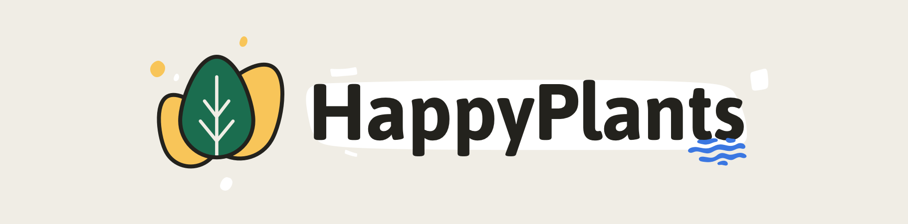

<h1 align="center">
  
</h1>

<p align="center">
  Current version: <code>1.0.0-alpha</code>
</p>

<p align="center">
  <a href="https://travis-ci.com/morkro/happy-plants">
    
  </a>
  
  <a href="http://makeapullrequest.com" target="_blank">
    
  </a>
</p>

---


[_HappyPlants_](https://happyplants.garden) is all about organising and adding all kinds of information of your little friends. _How much water does it need? During which seasons does it grow? When is it dormant? Does it require lots of sun?_ Basically, creating your own plant database in a visual way. You can either save HappyPlants to your homescreens on mobile devices (recommended) or add it to your bookmarks on desktop.

This project adheres to the Contributor Covenant [code of conduct](CODE_OF_CONDUCT.md).
By participating, you are expected to uphold this code. Please report unacceptable behavior.

-   [🌵 About](#about)
-   [✨ Features](#features)
-   [🎛 Data structure](#data-structure)
-   [⌨️ Development](#development)
-   [🎉 Credits](#credits)

---

## About
If your hobby is collecting (and growing) plants, you maybe also like to gather all the information about them and keep an organised overview about your little home garden.

_HappyPlants_ is a mobile-first, progressive web application which helps organising and keeping track of your plants. See the list of

---

## Features
This project is currently still in `alpha` development and only supports a bare minimum set of features.

### Overview page

| Feature | Description |
| ------- | ----------- |
| View mode | Choose between grid and category view. |
| Sort by | The overview can be sorted by date (latest first) and alphabetical. |

### Add plant

| Feature | Description |
| ------- | ----------- |
| Name and photo | Add a name and upload an additional, optional photo of the plant. |
| Add or create category | When adding a new plant, you can either add an existing category to it or create a new one. |

### Plant profile

| Feature | Description |
| ------- | ----------- |
| Edit basic data | Edit your plants name or photo. |
| Manage modules | Add/remove plant modules |
| Watering module | Manage the required watering of a plant. |
| Sunshine module | Manage the amount of sunlight the plant needs. |
| Seasons module | Lets you define the seasons in which a plant is in growth/ dormant. |
| Notes | Add notes to a plant. |
| Delete plant | Deletes your plant. |

### Categories

| Feature | Description |
| ------- | ----------- |
| Category | Create categories to which plants can be added. |

### Settings

| Feature | Description |
| ------- | ----------- |
| Import/export | Import or export plant data. |
| Delete all | Delete all plant data. This is permanent and lost data can't be restored. |

---

## Data structure
In the application settings, you can download and import your plant data.

### Basic plant data
This is the minimum required data of a single plant. If you want to import the data, it should be an Array of objects.

```typescript
{
  "guid": String, // [required] A random, version 4 GUID
  "created": Date, // [required] Date when the plant has been created
  "modified": Date, // [required] Date when plant has been modified, defaults to created date
  "name": String, // [required] Name of the plant
  "blob": Blob | Base64 | undefined, // [optional] A base64 encoded or Blob of the plant photo
  "categories": Array<Category> // [optional] Array of categories, defaults to []
  "modules": Array<PlantModule> // [optional] Array of plant modules, should default to []
}
```

### Category data
A plant can be assigned to various, user created, categories. A category object should be defined as follows:

```typescript
{
  "guid": String, // [required] A random, version 4 GUID
  "created": Date, // [required] Date when the plant has been created
  "modified": Date, // [required] Date when plant has been modified, defaults to created date
  "name": String, // [required] Name of the category
}
```

### Plant Modules
Modules have all the same structure with a module-specific `value` definition.

#### Watering module

```typescript
{
  "type": "watering",
  "value": {
    "level": 5
  }
}
```

#### Sunshine module

```typescript
{
  "type": "sunshine",
  "value": {
    "insensity": 1 | 2 | 3
  }
}
```

#### Seasons module

```typescript
{
  "type": "seasons",
  "value": {
    "seasons": [
      {
        "month": "January",
        "growth": Boolean
      },
      ...
    ]
  }
}
```

#### Notes module

```typescript
{
  "type": "notes",
  "value": {
    "notes": String
  }
}
```

---

## Development
This project supports Yarn, so you can either use `yarn` or `npm` to run tasks.

| Command | Description |
| ------- | ----------- |
| `yarn` / `npm install` | Installs dependencies |
| `yarn/npm run dev` | Serve with hot reload at localhost:8080 |
| `yarn/npm run build` | Build for production with minification |
| `yarn/npm run build --report` | Build for production and view the bundle analyzer report |
| `yarn/npm run unit` | Run unit tests |
| `yarn/npm run e2e` | Run end-to-end tests |
| `yarn/npm test` | Run all tests |
| `yarn/npm lint` | Runs `Standard` over all `.js` files |

This is an Vue.js progressive web application, bootstrapped with [`vue-init pwa`](https://github.com/vuejs-templates/pwa). For detailed explanation on how things work, checkout the [guide](http://vuejs-templates.github.io/webpack/) and [docs for vue-loader](http://vuejs.github.io/vue-loader).

[](https://github.com/standard/standard)

---

## Credits
### Logo
The logo is a combination of existing illustrations by [Vitaly Gorbachev](https://www.flaticon.com/authors/vitaly-gorbachev) and [Freepik](https://www.flaticon.com/authors/freepik).

### Icons
Icons taken from [Freepik](http://www.freepik.com) and [Dimitry Miroliubov](http://www.flaticon.com/authors/dimitry-miroliubov).

---

## License
[MIT](https:/github.com/morkro/happy-plants/LICENSE)
